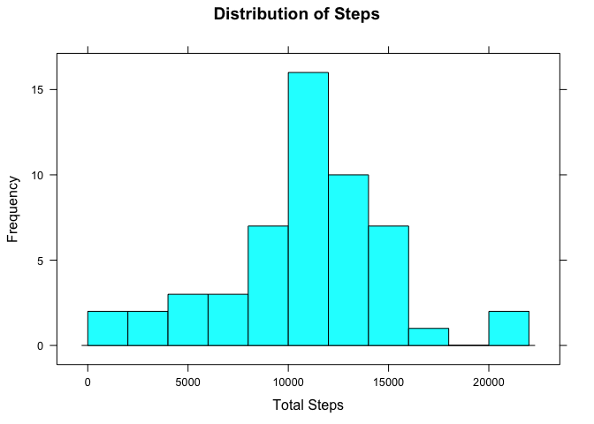
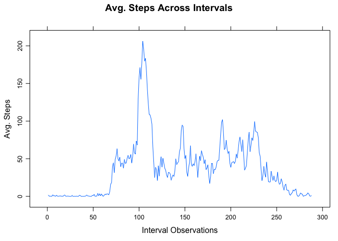
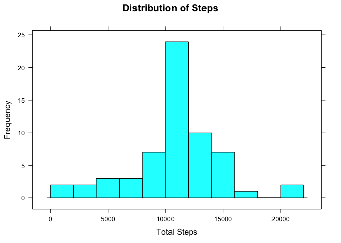
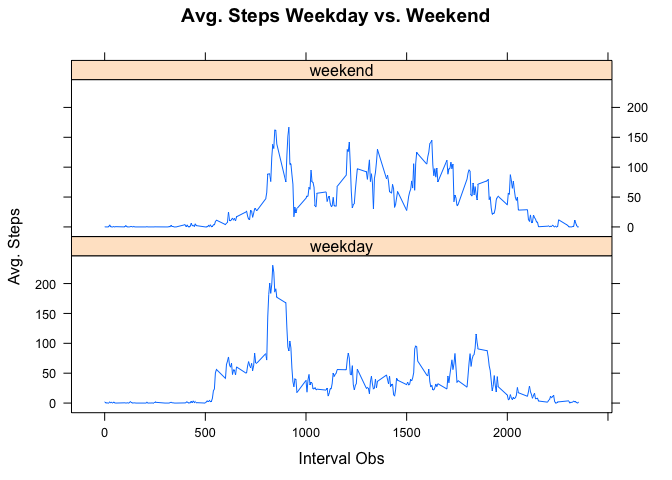

## Loading and preprocessing the data

```r
library("data.table")
library("lattice")

#load data
activityData <- data.table::fread(input="activity.csv", sep=",", header=TRUE, stringsAsFactors=FALSE, na.strings="NA")

#set date as date class (getting format right critical or else get NAs)
activityData$date  <- as.Date(activityData$date, format="%Y-%m-%d")
```


## What is mean total number of steps taken per day?

```r
#calculate sum of steps by day naming column "steps" with NA values left NA
sumStepsAsIs <- activityData[, .(steps=sum(steps, na.rm=FALSE)), keyby=date]
summary(sumStepsAsIs) #lists the mean and median
```

```
##       date                steps      
##  Min.   :2012-10-01   Min.   :   41  
##  1st Qu.:2012-10-16   1st Qu.: 8841  
##  Median :2012-10-31   Median :10765  
##  Mean   :2012-10-31   Mean   :10766  
##  3rd Qu.:2012-11-15   3rd Qu.:13294  
##  Max.   :2012-11-30   Max.   :21194  
##                       NA's   :8
```

```r
#get mean / median with NA values removed 
sumStepsRmNA <- activityData[, .(steps=sum(steps, na.rm=TRUE)), keyby=date]
summary(sumStepsRmNA) 
```

```
##       date                steps      
##  Min.   :2012-10-01   Min.   :    0  
##  1st Qu.:2012-10-16   1st Qu.: 6778  
##  Median :2012-10-31   Median :10395  
##  Mean   :2012-10-31   Mean   : 9354  
##  3rd Qu.:2012-11-15   3rd Qu.:12811  
##  Max.   :2012-11-30   Max.   :21194
```

```r
#using lattice to build histogram with count vs the default percent
histogram(sumStepsAsIs$steps, breaks=10, xlab="Total Steps", ylab="Frequency", type="count", main="Distribution of Steps")
```

<!-- -->


## What is the average daily activity pattern?

```r
#using lattice to build a line chart showing avg. steps over each interval obs. 
#the interval obs on x-axis is misleading given the way the obs are captured. 
# Ex: 200 avg. steps is not at interval 100 but obs 100 i.e. just after 8AM  
intervalSteps <- activityData[, .(steps=mean(steps, na.rm = TRUE)), keyby=interval]
xyplot.ts(intervalSteps$steps, type="l", xlab="Interval Observations", ylab="Avg. Steps", main="Avg. Steps Across Intervals")
```

<!-- -->

```r
#use which.max to get the index number of max steps and return the relevant row details 
intervalSteps[which.max(intervalSteps$steps)]
```

```
##    interval    steps
## 1:      835 206.1698
```


## Imputing missing values

```r
activityData[is.na(steps), .N]
```

```
## [1] 2304
```
2304 values out of 17568 have NA values

### Strategic Choice: Replace missing values with mean interval value 

```r
#copying data into a new dataset with NAs to be addressed
activityDataNAs <- activityData

    for(i in 1:nrow(activityDataNAs))
    {
            if(is.na(activityDataNAs$steps[i]))
            {
                activityDataNAs$steps[i] = intervalSteps$steps[intervalSteps$interval == activityDataNAs$interval[i]]
            }
    }
```

### Revisit the Histogram and Mean/Median Values

```r
#recalculating sum on new dataset
sumStepsRepNA <- activityDataNAs[, .(steps=sum(steps)), keyby=date]
summary(sumStepsRepNA) #shows mean and median
```

```
##       date                steps      
##  Min.   :2012-10-01   Min.   :   41  
##  1st Qu.:2012-10-16   1st Qu.: 9819  
##  Median :2012-10-31   Median :10766  
##  Mean   :2012-10-31   Mean   :10766  
##  3rd Qu.:2012-11-15   3rd Qu.:12811  
##  Max.   :2012-11-30   Max.   :21194
```

```r
#using lattice to build histogram with count vs the default percent
histogram(sumStepsRepNA$steps, breaks=10, xlab="Total Steps", ylab="Frequency", type="count", main="Distribution of Steps")
```

<!-- -->

## Are there differences in activity patterns between weekdays and weekends?

```r
#get weekday value of date, make it a factor and store as new column
activityDataNAs[, day:=factor(weekdays(activityDataNAs$date, abbreviate = TRUE))]
# side-note to drop a column: activityData[ , Day:= NULL]


#Option 1 of 2: Assign numeric value; select weekday row values, then set new col=1 or 0
#activityDataNAs[day %in% c("Mon", "Tue", "Wed", "Thu", "Fri"), weekday:=1]
#activityDataNAs[day %in% c("Sat", "Sun"), weekday:=0]
#faster but couldn't get panel strip to display 0-1 value; showed label

#Option 2 of 2: Assign char value; create null col, select weekday row values, then set new col
activityDataNAs[ , weekday := NULL]
```

```
## Warning in `[.data.table`(activityDataNAs, , `:=`(weekday, NULL)): Adding
## new column 'weekday' then assigning NULL (deleting it).
```

```r
activityDataNAs[day %in% c("Mon", "Tue", "Wed", "Thu", "Fri"), weekday:="weekday"]
activityDataNAs[day %in% c("Sat", "Sun"), weekday:="weekend"]
#on xy-plot strip shows weekday-weekend labels in split

weekdaySteps <- activityDataNAs[, .(steps=mean(steps, na.rm=TRUE)), keyby=.(weekday, interval)]

xyplot(weekdaySteps$steps ~ weekdaySteps$interval | weekdaySteps$weekday, type="l", xlab="Interval Obs", ylab="Avg. Steps", main="Avg. Steps Weekday vs. Weekend", layout=c(1,2))
```

<!-- -->

### Yes there are key differences between weekday and weekend activity patterns; weekdays tend to have more activity centered around the morning, where as weekends tend to be comparatively more evenly distributed throughout the day. 
